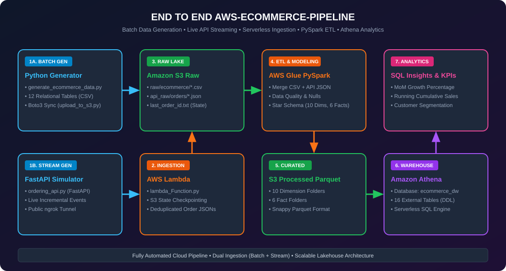
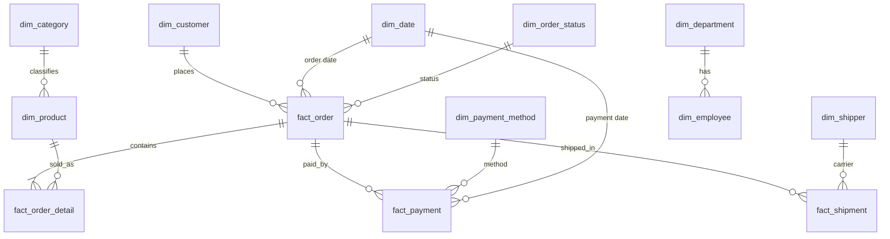
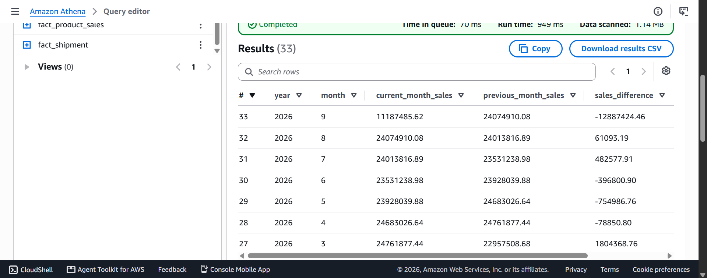

# End-to-End AWS E-Commerce Data Pipeline

A cloud-native Data Engineering project featuring dual ingestion (batch + near-real-time streaming), distributed PySpark ETL on AWS Glue, a Star Schema data warehouse (10 dimensions + 6 facts), and serverless analytics with Amazon Athena.



---

## 📌 Architecture Highlights

- **Synthetic Batch Generator**: Python script using `Faker` to generate 12 relational CSV tables (~100k records).
- **Automated S3 Sync**: Boto3 script uploading batch datasets to `s3://aws-ecommerce-data-abdelrahman/raw/ecommerce/`.
- **Live Stream Simulator**: FastAPI REST server generating live orders, ingested by AWS Lambda with S3 state checkpointing.
- **Distributed ETL**: PySpark on AWS Glue to clean nulls, remove duplicates, handle schema mapping, and build the Star Schema.
- **Curated Storage**: Snappy-compressed Parquet in S3 (`processed/ecommerce/`) for fast, cost-effective queries.
- **Serverless Analytics**: Amazon Athena external tables with advanced SQL (MoM growth, running totals, customer/product rankings).

##  Tech Stack

| Layer | Tools |
|---|---|
| Languages | Python, SQL, PySpark |
| Storage | Amazon S3 (raw → processed), Parquet + Snappy |
| Processing | AWS Glue (PySpark), AWS Lambda |
| Analytics | Amazon Athena |
| Tools | FastAPI, Boto3, Faker, ngrok, Git |

---

##  Data Flow

```
Faker generator ──► CSV (12 tables) ──► Boto3 sync ──┐
                                                     ├──► S3 raw/ ──► Glue (PySpark ETL) ──► S3 processed/ (Parquet) ──► Athena
FastAPI live orders ──► Lambda ──► S3 (+ checkpoint) ┘
```

---

##  Data Model (Star Schema)

The 12 raw source tables are cleaned and modeled into **16 tables: 10 dimensions and 6 facts**, stored as Parquet and exposed in Athena as external tables (`ecommerce_dw` database).



### Dimensions (10)

| Table | Key | Description |
|---|---|---|
| `dim_customer` | `customer_id` | Name, email, city, country, registration date |
| `dim_product` | `product_id` | Name, brand, price, cost, stock, `category_id` |
| `dim_category` | `category_id` | Product categories |
| `dim_department` | `department_id` | Company departments |
| `dim_supplier` | `supplier_id` | Supplier name and country |
| `dim_employee` | `employee_id` | Employees with `manager_id`, department, salary, hire date |
| `dim_shipper` | `shipper_id` | Shipping companies |
| `dim_date` | `date_id` | Calendar attributes: year, quarter, month, week, day name |
| `dim_payment_method` | `payment_method_id` | Payment methods |
| `dim_order_status` | `order_status_id` | Order lifecycle statuses |

### Facts (6)

| Table | Grain | Key measures |
|---|---|---|
| `fact_order` | One row per order | `customer_id`, `date_id`, `order_status_id` |
| `fact_order_detail` | One row per order line | `quantity`, `unit_price`, `discount`, `gross_amount`, `discount_amount`, `total_amount` |
| `fact_payment` | One row per payment | `amount`, `payment_method_id`, `date_id` |
| `fact_shipment` | One row per shipment | `ship_date`, `delivery_date`, `shipping_days` |
| `fact_customer_sales` | One row per customer *(aggregate)* | `total_orders`, `total_quantity`, `gross_sales`, `total_discount`, `total_sales`, `customer_segment` |
| `fact_product_sales` | One row per product *(aggregate)* | `total_orders`, `units_sold`, `gross_sales`, `total_discount`, `total_sales` |

> `fact_customer_sales` and `fact_product_sales` are pre-aggregated summary facts, built once in the ETL so common dashboards don't need to re-scan the transactional facts.

Full DDL: [`sql/athena_ecommerce_dw.sql`](sql/athena_ecommerce_dw.sql)

---

## 📊 Analytics (Athena)

The SQL file includes two sets of queries on top of the warehouse.

**Core aggregations**
- Total orders, customers, products, units sold, sales, and Average Order Value (AOV)
- Monthly sales / orders / quantity performance
- Sales by category and product, Top 10 products, Top 10 customers
- Order status breakdown, payment methods analysis, shipment performance

**Advanced (window functions)**
- Running cumulative sales by date
- Month-over-Month growth %
- Top 3 products per category (`DENSE_RANK`)
- Customer ranking by spending and order count

### Example: Month-over-Month growth

```sql
WITH monthly_metrics AS (
    SELECT d.year, d.month, SUM(fd.total_amount) AS current_month_sales
    FROM ecommerce_dw.fact_order_detail fd
    JOIN ecommerce_dw.fact_order fo ON fd.order_id = fo.order_id
    JOIN ecommerce_dw.dim_date d    ON fo.order_date = d.date
    GROUP BY d.year, d.month
)
SELECT
    year, month, current_month_sales,
    LAG(current_month_sales) OVER (ORDER BY year, month) AS previous_month_sales,
    ROUND(
        (current_month_sales - LAG(current_month_sales) OVER (ORDER BY year, month))
        / NULLIF(LAG(current_month_sales) OVER (ORDER BY year, month), 0) * 100, 2
    ) AS growth_percentage
FROM monthly_metrics
ORDER BY year, month;
```

### Example: Top 3 products per category

```sql
WITH ranked AS (
    SELECT c.category_name, p.product_name,
           SUM(fd.total_amount) AS total_sales,
           DENSE_RANK() OVER (PARTITION BY c.category_name
                              ORDER BY SUM(fd.total_amount) DESC) AS rnk
    FROM ecommerce_dw.fact_order_detail fd
    JOIN ecommerce_dw.dim_product p  ON fd.product_id = p.product_id
    JOIN ecommerce_dw.dim_category c ON p.category_id = c.category_id
    GROUP BY c.category_name, p.product_name
)
SELECT * FROM ranked WHERE rnk <= 3 ORDER BY category_name, rnk;
```

### Sample results



---

## 📂 Repository Structure

```
.
├── architecture/
│   └── architecture.svg          # Architecture diagram
├── sql/
│   └── athena_ecommerce_dw.sql   # Athena DDL (10 dims + 6 facts) + analytics queries
├── src/
│   ├── generate_ecommerce_data.py  # Faker data generator (12 CSV tables)
│   ├── upload_to_s3.py           # Boto3 batch upload to S3
│   ├── ordering_api.py           # FastAPI live order simulator
│   ├── lambda_Function.py        # Lambda ingestion + S3 checkpointing
│   └── Ecommerce_transformation_full_abdo.ipynb  # PySpark ETL job (AWS Glue)
├── docs/                           # Screenshots
├── .env.example.txt                # Required environment variables
└── README.md
```

---

## 🚀 How to Run

### Prerequisites
- An AWS account with access to S3, Glue, Lambda, and Athena
- AWS CLI configured (`aws configure`) with an IAM user/role that has permissions for those services
- Python 3.10+
- ngrok (only needed to expose the local stream simulator to Lambda)

### 1. Setup
```bash
git clone https://github.com/abdelrahman-ashraf9/aws-ecommerce-data-pipeline.git
cd aws-ecommerce-data-pipeline
pip install -r requirements.txt
cp .env.example.txt .env      # then fill in your values (bucket name, region, ...)
```
> Use your own S3 bucket name. The bucket in this repo (`aws-ecommerce-data-abdelrahman`) is globally unique to the author.

### 2. Generate and upload batch data
```bash
python src/generate_ecommerce_data.py     # creates 12 CSV tables (~100k records)
python src/upload_to_s3.py             # uploads to s3://<bucket>/raw/ecommerce/
```

### 3. (Optional) Start the live stream
```bash
uvicorn src.ordering_api:app --port 8000
ngrok http 8000                        # expose the local API
```
Point the Lambda function at the ngrok URL. Lambda reads new orders, writes them to S3, and stores its checkpoint in S3.

### 4. Run the ETL
Create an AWS Glue job from `src/Ecommerce_transformation_full_abdo.ipynb` and run it. Output is written as Snappy Parquet to `s3://<bucket>/processed/ecommerce/<table>/`.

### 5. Query with Athena
Open the Athena console and run [`sql/athena_ecommerce_dw.sql`](sql/athena_ecommerce_dw.sql). Replace the bucket name in each `LOCATION` with yours. It creates the `ecommerce_dw` database, all 16 external tables, and the analytics queries.

---

##  Design Decisions & Trade-offs

- **Batch + streaming into one lake.** Both paths land in the same S3 raw zone, so a single Glue job models everything downstream.
- **Parquet + Snappy.** Columnar storage means Athena scans only the columns a query needs, which lowers both cost and latency compared with CSV.
- **Athena external tables over a warehouse.** No cluster to manage and no data loading step: pay per query directly on S3. The trade-off is less control over performance than Redshift would offer.
- **Star Schema + aggregate facts.** Dimensions and transactional facts keep queries simple. Two pre-aggregated facts (`fact_customer_sales`, `fact_product_sales`) speed up common reporting.
- **Streaming is micro-batch, not true real-time.** Lambda + S3 checkpointing is cheap and simple, but it is not a substitute for Kinesis or Kafka at production scale. That is the natural upgrade path if throughput or latency requirements grow.
- **ngrok is for development only.** It exposes the local simulator to Lambda during testing. A real deployment would host the source behind API Gateway or replace it with an actual event source.
- **Synthetic data.** Generated with Faker so the project is reproducible without any private data. It does not capture real-world skew or messiness.

---

## 🔮 Future Improvements

- [ ] **Orchestration**: schedule and chain the pipeline with Step Functions + EventBridge
- [ ] **Data quality checks**: fail the Glue job on nulls / duplicate keys / empty tables
- [ ] **Tests + CI**: pytest for transformations and a GitHub Actions workflow
- [ ] **Infrastructure as Code**: Terraform for S3, Glue, Lambda, and IAM
- [ ] **Partitioning**: partition large facts (e.g. by `date_id`) to reduce Athena scan cost
- [ ] **Streaming upgrade**: Kinesis Data Streams / Firehose instead of Lambda micro-batching

---

## 👤 Author

**Abdelrahman Ashraf** · [GitHub](https://github.com/abdelrahman-ashraf9)
· [LinkedIn](https://www.linkedin.com/in/abdelrahman-ashraf9) 
